# Tutorial: Instalando compilador C e compilando programas no telefone celular

## Objetivo

Preparar um telefone celular para editar, compilar e executar programas escritos em C.

## Introdução

A estação de trabalho de um programador, usualmente, tem um desktop ou um notebook para desenvolver os programas.

Quando a proposta é *aprender a programar em C*, as ferramentas de referência são um compilador C e um editor de texto. Para essas ferramentas serem executadas outros programas, como o Sistema Operacional, são necessários.

Neste tutorial a proposta é *preparar um telefone celular para editar, compilar e executar programas escritos em C*, permitindo usar uma estação de trabalho que não é tão usual para programadores mas é usual para pessoas aprendendo a primeira linguagem de programação.

## Materiais e métodos

O telefone celular em que este tutorial foi feito é um Galaxy S24FE com interface gráfica OneUI 8, baseada no Android 16.

A fim de chegar ao objetivo uma sequência de atividades deve ser executada com sucesso. A fim de facilitar a execução e depuração das atividade, estas serão divididas em passos, que são sub-sequências de atividades. Cada sub-sequência tem uma meta a atingir e um indicador de atingimento de meta. As seguintes metas serão executadas e testadas:
  
1. Instalar Termux
2. Acessar os arquivos do telefone (ex.: pasta Downloads) através do Termux
3. Instalar o compilador
4. Escrever um programa curto
5. Compilar e executar o programa
6. Fazer uma cópia do programa na pasta Downloads

Termux é um aplicativo que começou como um emulador de terminal com alguma funcionalidade de sistema operacional Linux e, hoje em dia, está mais para um emulador de Linux em modo terminal. Seu site oficial é https://termux.dev/en/ .

Termux, por padrão, não tem acesso ao restante dos arquivos do telefone celular. Um comando precisa ser executado para configurar esse acesso.

O compilador C mais comum para Linux (para Termux também) é o `gcc`. Ele não vem instalado por padrão no Termux. Instalá-lo requer executar um comando.

Um editor de texto instalado por padrão no Termux é o `nano`.

Todos os aplicativos são gratuitos.

## Resultados e indicadores de sucesso

### Instalar Termux

Para versões de Android 12 ou mais recente, Termux é um aplicativo que está na loja Google. Entre pela loja, procure por Termux e o instale.

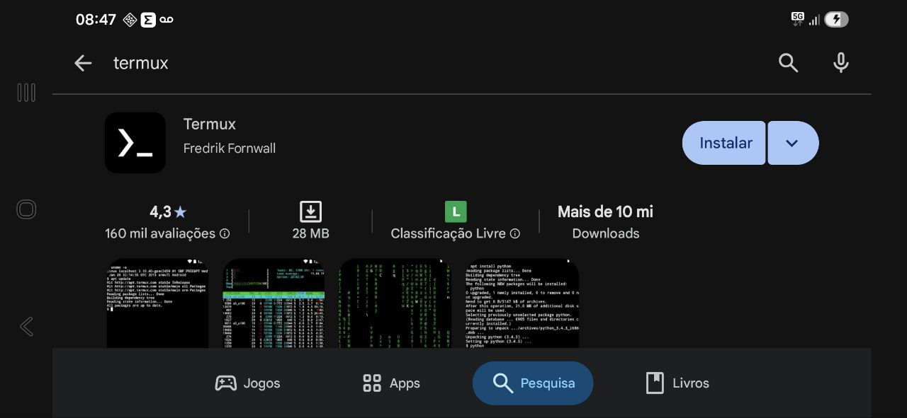

Abrindo (iniciando) Termux, uma janela de terminal se abre.

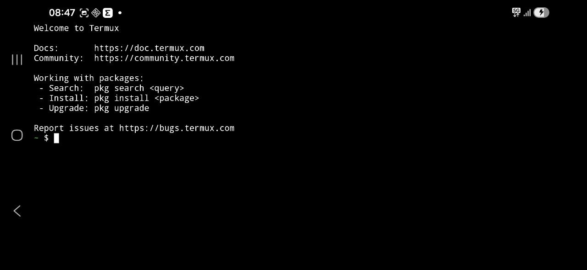

 Comandos de shell do Linux, como `ls` podem ser executados no Termux.

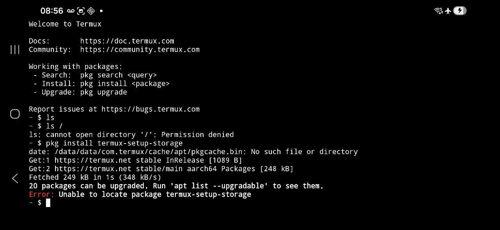

O primeiro `ls` lista os arquivos no diretório corrente. O diretório corrente está vazio (de arquivos visíveis).

O segundo `ls`, de fato, `ls /` tenta listar os arquivos no diretório raiz. O diretório raiz está protegido para leitura então seu conteúdo não é mostrado e a mensagem `Permission denied` é mostrada. Note que `/` é um argumento de chamada de `ls`

O terceiro comando é a tentativa de executar o programa `pkg` para instalar um pacote de identificador `termux-setup-storage`. O programa conecta-se a um repositório de pacotes na internet e "busca pelo pacote" como o pacote não é achado, apresenta o erro `Unable to locate package termux-setup-storage.

A execução desses mesmos comandos e a obtenção desses mesmos resultados indica sucesso na instalação do Termux.

### Acessar os arquivos do telefone (ex.: pasta Downloads) através do Termux

Acessando a documentação adequada do Termux (https://wiki.termux.com/wiki/Internal_and_external_storage) vê-se que `termux-setup-storage` é um programa que, através do Termux, permite dar acesso a partes do armazenamento interno do telefone celular. 

No terminal, execute `termux-setup-storage` (ié digite termux-setup-storage\<ENTER\>). Uma caixa contendo uma lista de opções se abre no Android. As opções são partes do armazenamento interno do telefone celular. Selecione as partes que deseja que Termux tenha acesso (por exemplo, a pasta Downloads). A lista não tem confirmação porque os ajustes têm efeito imediato. Acredito que seja possível mudar as configurações de acesso usando esse mesmo comando.


Volte para o terminal e digite ls, o diretório `storage` deve ser listado. 


Liste o conteúdo de `storage` e veja que o diretório `Downloads` está entre os resultados.

Liste o conteúdo de `Downloads` com o comando `ls storage/downloads`. Note que `storage/downloads` é argumento para o comando `ls` e que, no Termux, o identificador da pasta inicia com `d` minúsculo.

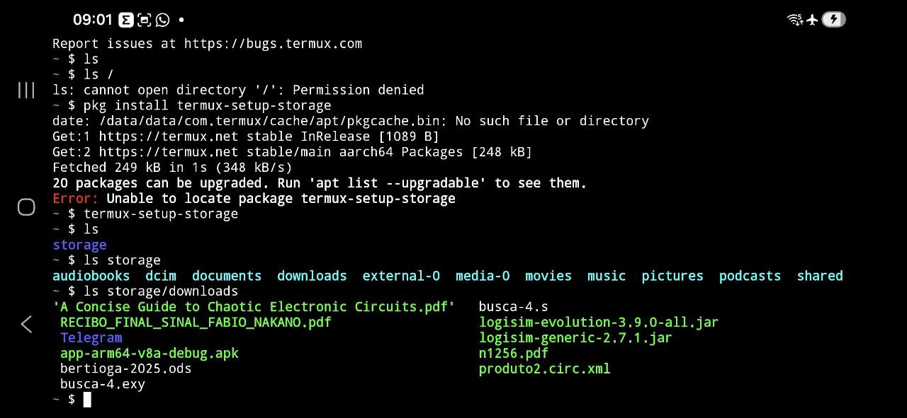

A execução desses mesmos comandos e a obtenção desses mesmos resultados indica sucesso na instalação do acesso do Termux aos arquivos armazenados no telefone celular.

### Instalar o compilador

No Linux e similares, como Termux, aplicativos são distribuídos através de pacotes. Estes são acessados através de comandos específicos (ex.: snap, apt, dpkg, rpm, pkg, ...). Instalar um pacote, geralmente, é feito executando um desses comandos. A instalação pode ser feita para todos os usuários do sistema ou somente para o usuário que executou a instalação.

Instalar o compilador C no Termux corresponde a executar `pkg install clang` no terminal.

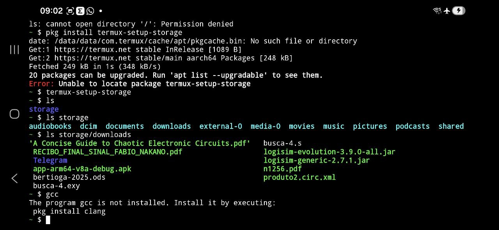

Durante a instalação mensagens são mostradas na tela

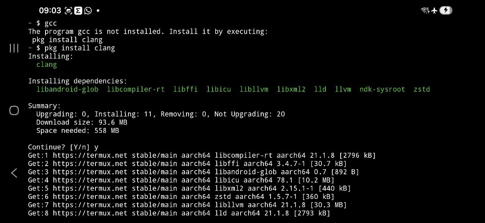


### Escrever um programa curto

Nas linguagens de programação que conheço, um dos programas mais curtos que podem ser escritos imprime na tela alguma mensagem e termina. Geralmente é Olá Mundo (Hello world). Neste tutorial, veja a listagem abaixo ou baixe [hello.c](./hello.c) .

```c
#include <stdio.h>

int main () {
  puts("Olá!!!");
}
```

Para criar um arquivo e digitar seu conteúdo usa-se um editor de texto. Um editor de texto instalado por padrão no Termux é `nano`. No terminal digite `nano\<ENTER\>`.

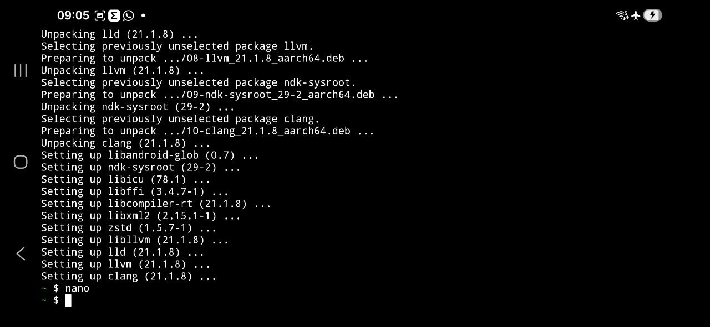

Nano é um editor de texto para terminal então não tem menus, botões e outros elementos gráficos. Os comandos são executados por atalhos de teclado.

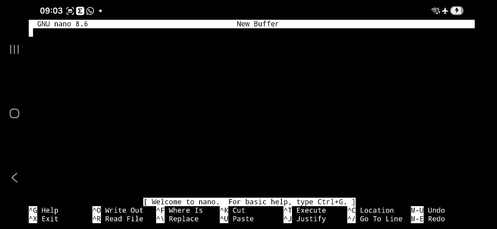

Digite o texto do arquivo `hello.c` e grave-o no armazenamento do Termux digitando CTRL-S.
Dê o nome `hello.c` ao arquivo e tecle ENTER.

O arquivo deve ter sido criado no diretório corrente, você pode verificar digitando `ls`.

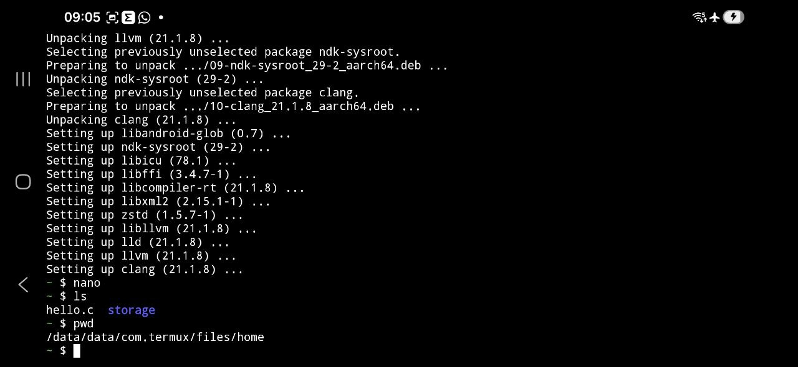

O conteúdo do arquivo pode ser mostrado no terminal com o comando `cat`. Digite `cat hello.c\&lt;ENTER\&gt;`

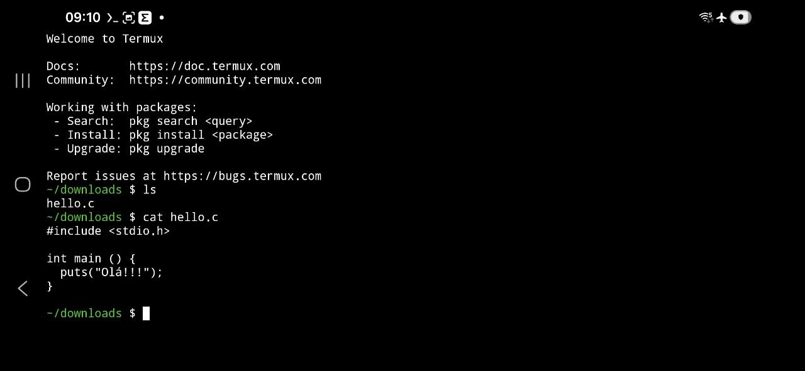

### Compilar e executar o programa

O programa é compilado com o comando `gcc hello.c`. Como resultado da compilação é criado o arquivo `a.out`. 

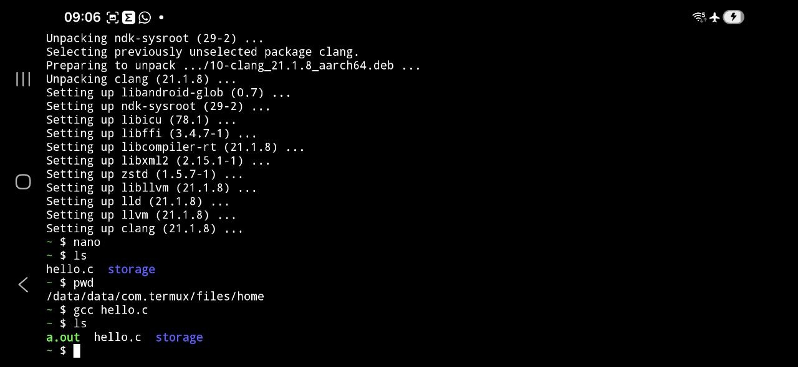

Executar o arquivo `a.out` corresponde a digitar no terminal `./a.out`. Na execução, a mensagem `Olá!!!` é escrita no terminal.

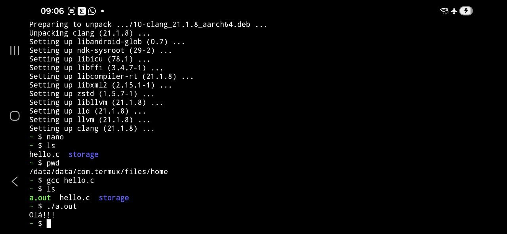

### Fazer uma cópia do programa na pasta Downloads

O comando `cp` faz cópia de arquivos. Digite `cp hello.c storage/downloads` para criar uma cópia de `hello.c` na pasta `Downloads`.

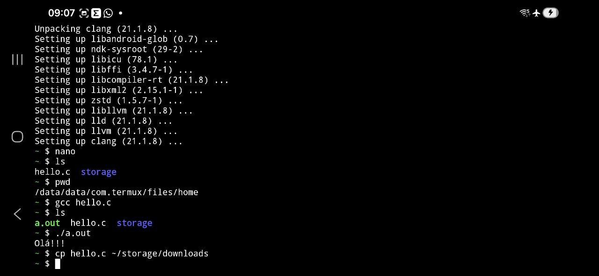

Essa cópia pode ser acessada com o aplicativo `Arquivos` do Android.

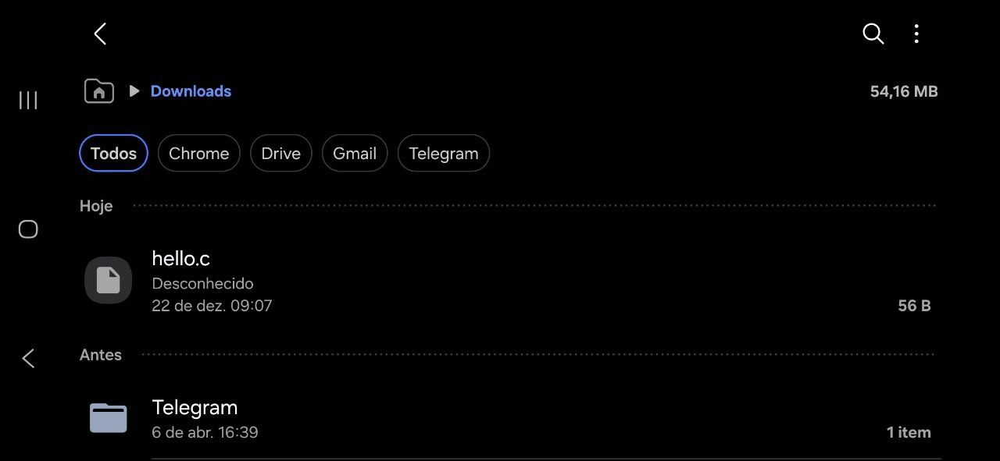

Ocorreu um erro nessa particular instalação do Termux ao tentar abrir com o Arquivos do Android o arquivo `hello.c`. O instalador do Termux configurou o Android para abrir arquivos com extensão `c` usando o Termux com o comando \$HOME/bin/termux-file-editor (lembrando, comando pode ser um programa e programas podem estar (ou, em certa medida, pode ser) um arquivo). Para o comando funcionar espera-se que o arquivo seja um script ou um link simbólico para um editor de texto mas o arquivo não existe.
 
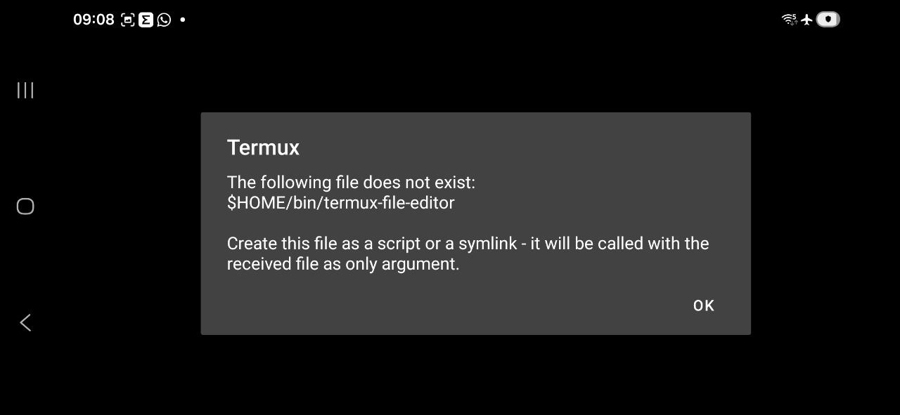

## Conclusão e discussão

Neste tutorial mostra-se, passo a passo, como preparar e usar um telefone celular como estação de trabalho para o programador.

Cada um dos passos tem indicadores de sucesso e, até certo ponto, permitem identificar problemas na execução do passo.

Os passos também podem servir como ponto de partida para outros tutoriais.

O próximo passo neste tutorial é testá-lo e colher opiniões de quem o testou.

Opiniões e propostas de melhorias neste e noutros tutoriais e materiais da apostila podem ser feitas através de *pull requests* ou através das [discussões](https://github.com/FNakano/IP-Apostila/discussions). O atendimento das propostas é decidido por este autor.

