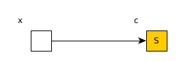
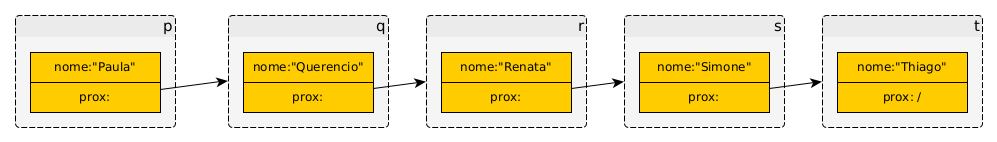
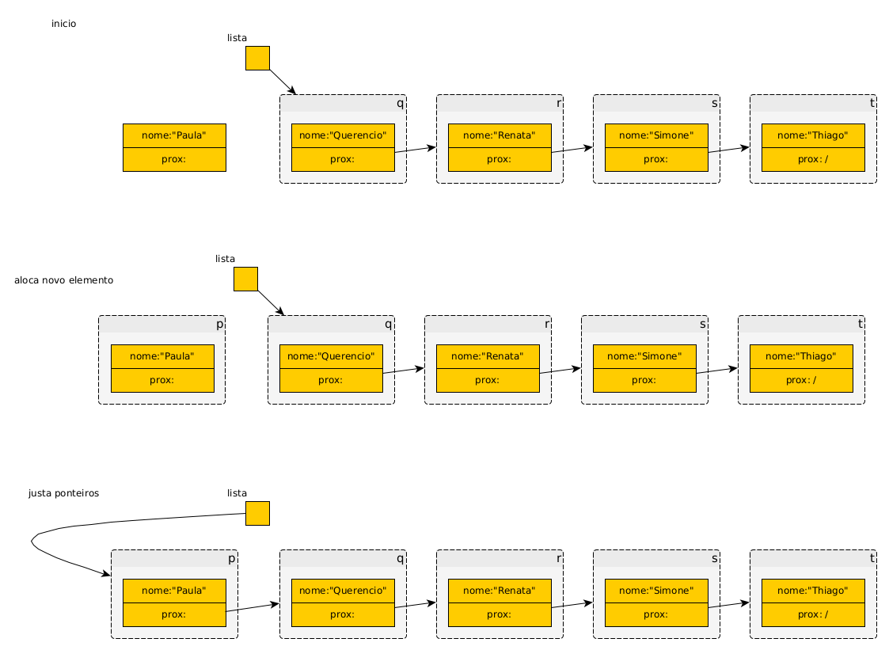

# Memória do computador (RAM) e representações associadas

No nível de um primeiro curso de programação em C, após praticar o básico sobre variáveis, operações, comandos e funções, acredito que conhecer um modelo (abstrato) de memória e seu uso nos programas seja útil.

Esse conhecimento servirá como base para explicar tipos derivados (ou abstratos) de dados, ponteiros, alocação dinâmica de memória e sua relação com funções, escopo de variáveis e passagem de argumentos (parâmetros).
 
O modelo de memória baseia-se em uma lista indexada de elementos de mesmo tipo. É a mesma definição de array (vetor). Uma particularidade: o índexador da memória é chamado endereço. Assim, diz-se que um conteúdo está armazenado em um endereço. Tanto conteúdo quanto endereços podem ser considerados números. 

| Endereço | Conteúdo |
| --- | --- |
| 0 | ? |
| 1 | ? |
| 2 | ? |
| 3 | ? |
| 4 | ? |
| 5 | ? |
| ... | ... |
| 1000 | ? |
| 1001 | ? |
| 1002 | ? |
| 1003 | ? |
| 1004 | ? |
| ... | ... |

Inicialmente, na falta de mais informação, considera-se o conteúdo desconhecido e isto é representado, neste documento, por pontos de interrogação. Em documentos de outros autores já vi usar X, $\varnothing$, NA, DC, hífen, espaço em branco.

No que tange a programas, variáveis e constantes, ou instruções e dados, considerando um modelo abstrato simples de um computador, pode-se dizer que todos são armazenados na memória.

Destacando como as variáveis são armazenadas na memória, duas características são comuns a todas as variáveis: Qual o endereço em que a variável está armazenada e quanto da memória é ocupada pela variável. Em C, o operador de referência (´&´) responde à primeira pergunta para variáveis de tipo primitivo, nas variáveis de tipo derivado o endereço está armazenado na variável. Ainda em C, o operador `sizeof` responde à segunda pergunta. 

Experimente imprimir o resultado de `sizeof char`, `sizeof int`, `sizeof float`, `sizeof double`, ou crie uma variável, digamos `v` e imprima tanto `&v` quanto `sizeof v`, varie os tipos de `v`.

Agora convém apresentar um pouco de contexto: Convenciona-se que, para programadores, a unidade de armazenamento e acesso é um byte = 8 bits (https://en.wikipedia.org/wiki/Byte). Durante o projeto de algoritmos, em determinados níveis de abstração, o tamanho da variável não é importante, desde que cada uma tenha seu endereço único. Essa abstração permite explicações suficientemente detalhadas para o projeto. Considerar o tamanho é necessário para implementar o algoritmo mas, fazer isso quando não é esse o foco, pode ser maçante.  

Frase: "Memória pode ser pensada como um array de bytes."

## Exemplo de array armazenado na memória (parte é recordação)

Considero o tipo de dados derivado mais simples: Array (ou vetor) é uma sequência indexada de elementos iguais (https://en.wikipedia.org/wiki/Array_(data_structure)).

O exemplo fica mais fácil de entender se *usar didaticamente* elementos do tipo (primitivo) `char`. "Em C, uma palavra é um array de caracteres" continua sendo verdadeira mas a representação de caracteres em computadores evolui e as linguagens de programação também. Esta evolução tornou *codificação de caracteres* algo um pouco mais complicado do que pretendo usar. *Usar didaticamente* é *nos restringirmos a usar somente caracteres da tabela ASCII (https://en.wikipedia.org/wiki/ASCII)* pois com esses caracteres, um `char` tem tamanho de 1 byte.

A fim de exemplificar uso da memória, a palavra Hello, segundo a tabela ASCII, gravada na memória a partir do endereço 1000, fica armazenada:
  
| Endereço | Conteúdo (número) | Conteúdo (letra) |
| --- | --- | --- |
| 0 | ? | ? |
| 1 | ? | ? |
| 2 | ? | ? |
| 3 | ? | ? |
| 4 | ? | ? |
| 5 | ? | ? |
| ... | ... | ... |
| 1000 | 72 | H |
| 1001 | 101 | e |
| 1002 | 108 | l |
| 1003 | 108 | l |
| 1004 | 111 | o |
| 1005 | 0 | \0 |
| ... | ... | ... |

destacando que em C, sequências de caracteres recebem um byte de valor zero para representar seu final. Usamos 6 bytes para armazenar essa palavra.

É possível escrever um programa para testar se a explicação dada até aqui é aceitável...

```C
#include <stdio.h>

char v[]="Hello";

int main () {
  int n=sizeof v;
  // os rótulos "endereço de v" e "tamanho de v" são corriqueiros e fazem
  // sentido quando se trata de arrays MAS a interpretação fica distorcida
  // se considerarmos v um ponteiro. Devemos esclarecer que v não é um 
  // ponteiro, embora seja equivalente em muitos aspectos.
  printf ("endereço de v: %p, tamanho de v=%d\n", v, n);  
  for (int i=0;i<n;i++) {
    printf ("| %p | %d | %c |\n", &(v[i]), v[i], v[i]);
  }
}
```

Executando o programa acima em um compilador on-line obtemos:

```
endereço de v: 0x404018, tamanho de v=6
| 0x404018 | 72 | H |
| 0x404019 | 101 | e |
| 0x40401a | 108 | l |
| 0x40401b | 108 | l |
| 0x40401c | 111 | o |
| 0x40401d | 0 |   |


=== Code Execution Successful ===
```

Supondo que está tudo entendido até aqui, vamos falar sobre cópia de arrays ...

A novidade do curso agora é apresentar, nas explicações, fragmentos de código ao invés de programas completos.

... tente inicializar um string em C usando atribuição:
  
```c

char nome[128];
nome="Mauricio";

```

... você receberá um erro de compilação como:
  
<pre><font color="#8AE234"><b>fabio@super</b></font>:<font color="#729FCF"><b>~/MeuGithub/IP-Apostila/listaLigada</b></font>$ gcc listaLigada.c 
<b>listaLigada.c:</b> In function ‘<b>main</b>’:
<b>listaLigada.c:14:9:</b> <font color="#EF2929"><b>error: </b></font>assignment to expression with array type
   14 |   p.nome<font color="#EF2929"><b>=</b></font>&quot;Mauricio&quot;;
      |         <font color="#EF2929"><b>^</b></font>
<font color="#8AE234"><b>fabio@super</b></font>:<font color="#729FCF"><b>~/MeuGithub/IP-Apostila/listaLigada</b></font>$ 
</pre>

Em C, a atribuição de uma string constante imediata a uma variável não é feita de maneira transparente para o programador. A cópia precisa ser feita elemento a elemento ou usando funções que copiam conteúdos de blocos de memória como `strcpy` e `memcpy`. Nota: *transparente* neste contexto significa *invisível*.

Poderia ser um exercício interessante (para treinar comandos de repetição) escrever o programa que faz a cópia elemento a elemento mas vamos usar `strcpy`:
  
```c
#include <string.h> // protótipo de strcpy neste header
char nome[128];

...

  strcpy (nome,"Mauricio");

```

Há alguns detalhes a explicar, todos são apresentados na documentação da função então não vou repetir a explicação aqui... para saber como usar e detalhes sobre `strcpy` use `man 3 strcpy` no terminal do Linux. Cabe destacar que a área de memória que recebe a cópia precisa estar apropriadamente alocada e que a função só copia, não faz nenhuma verificação.

## Ponteiros

Eu defino ponteiros como variáveis de tipo primitivo cujo conteúdo é tratado como um endereço. Esse endereço geralmente é o de uma (outra) variável. Interpretando como programador, um ponteiro é uma **referência** para uma (outra) variável.

Através dos ponteiros os programas podem  

Indica-se que uma variável é um ponteiro quando em sua *declaração* o identificador é precedido de asterisco (*). Por exemplo: `char *s`, `int *A`, `FILE *fp`.

IMPORTANTE: `char *x` e `char x[n]` **não são** declarações para *a mesma coisa* - correndo o risco de quebrar a sequência: experimente compilar ou veja [demo1.md](./demo1.md).

Vamos nos concentrar em `char *x` que é ponteiro para caracteres.

Lembrando que quando uma variável é criada seu conteúdo não é inicializado e ponteiros são variáveis. Vamos ao programa...


```c
#include <stdio.h>

int main () {
  char c;
  c='S';
  printf ("O conteúdo %c, interpretação numérica %d está armazenando na variável c cujo endereço é %p.\n", c, c, &c);

  char *x;
  x=&c; // este comando é o importante!
  printf ("x, que recebeu o endereço da variável c, contém %p.\n", x);
  printf ("o endereço de x é %p.\n", &x);
  return 0;  
}  
  
```

A execução do programa acima resulta em:
  
```
O conteúdo S, interpretação numérica 83 está armazenando na variável c cujo endereço é 0x7ffc2acb441f.
x, que recebeu o endereço da variável c, contém 0x7ffc2acb441f.
o endereço de x é 0x7ffc2acb4410.


=== Code Execution Successful ===
```

O conceito de ponteiro é simples assim: "variáveis de tipo primitivo cujo conteúdo é tratado como um endereço". 

<!--- Na minha opinião, o poder do conceito e a complicação para usar esse poder, vem do conceito (linguístico) de referência. Ponteiro é a ferramenta, em linguagens de programação, para implementar referências e referências podem ser referenciadas numa cadeia infinita. É uma questão, em linguística, se até que ponto é possível confundir (ié usar de forma intercambiável) o objeto físico (a maçã) com sua referência (a palavra maçã). Na minha opinião, o objeto físico não pode ser **completamente** confundido com a referência - linguagens nunca expressarão com precisão absoluta objetos do mundo físico... mas isto é uma questão filosófica... --->

O programa acima usa memória para armazenar variáveis. Iniciando pela representação da memória e os conteúdos, passaremos por outras representações que podem ser mais convenientes em função do que deseja-se destacar.

Representação da memória e seus conteúdos: 
  
| Endereço | Conteúdo |
| --- | --- |
| 0 | ? |
| 1 | ? |
| 2 | ? |
| 3 | ? |
| 4 | ? |
| 5 | ? |
| ... | ... |
| 0x7ffc2acb4410 | 0x1f |
| 0x7ffc2acb4411 | 0x44 |
| 0x7ffc2acb4412 | 0xcb |
| 0x7ffc2acb4413 | 0x2a |
| 0x7ffc2acb4414 | 0xfc |
| 0x7ffc2acb4415 | 0x7f |
| 0x7ffc2acb4416 | 0x00 |
| 0x7ffc2acb4417 | 0x00 |
| 0x7ffc2acb4418 | ? |
| 0x7ffc2acb4419 | ? |
| 0x7ffc2acb441a | ? |
| 0x7ffc2acb441b | ? |
| 0x7ffc2acb441c | ? |
| 0x7ffc2acb441d | ? |
| 0x7ffc2acb441e | ? |
| 0x7ffc2acb441f | 83 |
| ... | ... |

**nota**: usei um programa para certificar que a ordem dos bytes do conteúdo de x no computador que usei (programiz) é mesmo essa. Apresentarei o programa mais adiante pois uso `union` e, neste momento, ainda não expliquei do que se trata.

A representação da memória, acima, tem o essencial mas não ajuda quem a lê a entender o que significa no contexto do programa... Seria conveniente que os identificadores das variáveis estivessem presentes e que os conteúdos das variáveis fossem apresentados inteiros e não fossem fracionados em seus bytes. É nesta representação que começamos a pular endereços e acrescentar rótulos. Fica mais fácil ver que a variável x contém o valor 0x7ffc2acb441f e esse valor é o endereço da variável c, logo, x aponta para c:
  
| Rótulo | Endereço | Conteúdo |
| --- | --- | --- |
|  | 0 | ? |
|  | 1 | ? |
|  | 2 | ? |
|  | 3 | ? |
|  | 4 | ? |
|  | 5 | ? |
|  | ... | ... |
| x: | 0x7ffc2acb4410 | 0x7ffc2acb441f |
|  | ... | ... |
| c: | 0x7ffc2acb441f | 83 |
|  | ... | ... |


**nota**: computadores e programas não precisam dos identificadores, apenas dos endereços. Identificadores são necessários para os programadores entenderem com mais facilidade o que estão fazendo.

Existem representações ainda mais abstratas, como o diagrama abaixo onde as caixas representam os conteúdos, os rótulos das caixas estão fora das caixas e são os identificadores das variáveis e os valores dos conteúdos são escritos dentro das caixas. Se o conteúdo for um endereço (consequentemente a variável é um ponteiro/referência), ao invés de escrever o conteúdo (endereço apontado), uma seta inicia na respectiva caixa e termina (aponta) para a caixa que representa o conteúdo apontado:



Representações como esta são usadas quando o destaque é dado a estruturas de dados (e algoritmos). Vamos ver como estruturas de dados são declaradas em C...

Resumo: `*` como modificador na declaração de variáveis, `&` como operador em expressões envolvendo variáveis.

## struct

A palavra reservada `struct` permite ao programador definir tipos de dados (também chamados estruturas de dados) a partir dos tipos já existentes. Numa explicação simples, `struct` define uma estrutura pela concatenação dos tipos usados. Isto permite que dados relacionados sejam agrupados. Por exemplo, os dados relacionados ao acesso de programas a arquivos é agrupado em um tipo de dados chamado `FILE`, definido em `stdio.h` (ou em algum *header* incluído nele). Nota: a definição de tipos de dados geralmente é feita em algum *header file*.

Estruturas de dados são usadas para definir listas, árvores, grafos, matrizes, ... algumas dessas estruturas são detalhadamente estudadas em disciplinas que tratam de estruturas de dados.

A título de exemplo definiremos um tipo de dados que será usado como elemento (nó) em uma lista ligada:
  
```c
/* Definição de um elemento da lista ligada */
struct Pessoa {
  char nome[128];
  struct Pessoa *prox;
};

```

Esse elemento é formado pela concatenação de um array de até 128 caracteres com um ponteiro, consequentemente tem 136 bytes - verifique com `sizeof`.

Listas ligadas são listas em que um elemento contém, entre outras variáveis, uma referência para o próximo elemento na lista. Escolhi esta estrutura (e não uma mais simples) porque seu uso elicita características da linguagem como passagem de parâmetro por valor e *shallow copy* que são escolhas feitas pelos desenvolvedores da linguagem e que influenciam na vida (prazos, madrugadas) dos programadores quando não são bem compreendidas.

Voltando a `struct`, o tipo `struct Pessoa` contém dois campos. Um dos campos se chama `nome` e é um array de caracteres, o outro campo se chama prox e é um ponteiro para uma variável do tipo `struct Pessoa`. Os campos são acessados com o operador ponto `.` (poderia ser com a flecha `->` mas vamos um por vez). Vamos criar elementos (da maneira usual, o que veremos que é simples mas ingênuo) e encadeá-los.


```c
/* Definição de um elemento da lista ligada */
struct Pessoa {
  char nome[128];
  struct Pessoa *prox;
};

int main () {
  struct Pessoa p, q, r, s, t;
  strcpy (p.nome, "Paula");
  strcpy (q.nome, "Querencio");
  strcpy (r.nome, "Renata");
  strcpy (s.nome, "Simone");
  strcpy (t.nome, "Thiago");
  p.prox=&q;
  q.prox=&r;
  r.prox=&s;
  s.prox=&t;
  t.prox=&NULL;
}

```

Numa variação do diagrama, apresentando os nomes dos campos e das variáveis com os recursos disponíveis no programa (YEd - https://www.yworks.com/products/yed)



Uma das operações mais comuns em listas é percorrê-la - é interessante como isto pode ser feito em uma lista ligada:
  
```c
/* Depois de criar os elementos e ligá-los */
  struct Pessoa *atual;
  atual=&p;
  while (atual!=NULL) {
    printf ("nome: %s\n", (*atual).nome);
    atual=(*atual).prox;
  }
```

Como o propósito aqui é destacar os elementos da linguagem de programação, não a estrutura de dados, trataremos de endereços e conteúdos. A variável `p` é uma variável do tipo `struct Pessoa`. `atual` é um ponteiro para variáveis do tipo `struct Pessoa`, vamos usá-lo para percorrer a lista. Como `p` é o primeiro elemento da lista, fazemos `atual` referenciar `p`. Lembrando que o último elemento da lista tem `prox==NULL` (isto marca o último elemento), testar `(atual!=NULL)` fará o loop parar no momento correto (antes de acessar NULL.nome o que seria péssimo). Como `atual` é um ponteiro e desejamos acessar o campo, que é um conteúdo, então usamos `(*atual)`. Os parêntesis são necessários para garantir a precedência do operador `*` sobre o operador `.` na expressão.

Caso haja dificuldade com o operador `*`, recomendo testar com uma variável de tipo primitivo ou com o acesso a um elemento de array através de ponteiros.

Existe uma maneira mais curta para acessar o conteúdo a partir de um ponteiro, usando o operador flecha `->`. A diferença entre ponto e flecha é que o primeiro se aplica a struct e o segundo a um ponteiro para struct. O código fica:

```c
/* Depois de criar os elementos e ligá-los */
  struct Pessoa *atual;
  atual=&p;
  while (atual!=NULL) {
    printf ("nome: %s\n", atual->nome);
    atual=atual->prox;
  }
```

Resumo: Definir struct, usar struct, operador `.`, `*` sobre ponteiros como operador de acesso, `->` como operador de acesso.

Comentário: Os identificadores q,r,s,t, dos elementos da lista não são necessários.

### lidar com structs

A linguagem oferece vários recursos que podem ser usados para lidar com structs, alguns têm efeitos colaterais, às vezes, indesejados ou levam a situações difíceis de lidar. Por exemplo, criar variáveis do tipo `struct Pessoa` da maneira como exemplificado pode ser fácil mas como poderíamos criar muitas delas? - Da maneira apresentada, não é imediato ver uma maneira de usar comandos de repetição e "ir criando" variáveis... Isto até é contornável mas o programa, como um conjunto de soluções, ficaria muito particular (de um programador e de um compilador). Por outro lado, muitos programadores já lidaram com situações parecidas, compartilharam soluções e acabaram criando padrões *de facto*. É um desses que será apresentado a seguir.

Em C, variáveis derivadas são criadas por alocação dinâmica de memória e são passadas para funções por referência (ié ponteiros). [Texto sobre argumentos de funções](./funcoes.md)


As funções mais comuns para alocação dinâmica de memória são `malloc(...)`, `calloc(...)`, `free(...)` - seus protótipos estão em `stdlib.h` . Veja `man 3 malloc` para a documentação das funções.

... já que estamos com um exemplo usando listas ligadas, seguiremos nele. Criaremos funções para percorrer a lista, criar elementos, inserir elementos na lista, remover elementos da lista. A função de percorrer pode ser facilmente ajustada para buscar e atualizar elementos na lista de maneira que CRUD (Create, Retrieve, Updade, Delete) é satisfeito. A ordem de apresentação foi pensada para facilitar o entendimento do uso de alocação dinâmica e ponteiros (ler é mais fácil que escrever). Convém, então, começar com uma lista existente o que foi feito no código listaLigada.c

Uma variável precisa de um identificador para ser referenciada pelo programador. No código-fonte, variável é a associação entre um identificador e uma área de memória então, frequentemente, convém usar variáveis do tipo ponteiro para prover essa referência. Em geral, a referência (ponteiro) a uma lista ligada coincide com a referência ao primeiro elemento da lista. Vamos aproveitar e já apresentar a função que percorre a lista (refatorar o código). Por conveniência, as funções ficarão todas em um único arquivo.


```c
#include <stdio.h>
#include <string.h>

/* Definição de um elemento da lista ligada */
struct Pessoa {
  char nome[128];
  struct Pessoa *prox;
};

int percorre (struct Pessoa *l) {
  /* struct Pessoa *atual;
   * é boa prática preservar o ponteiro para a lista mas neste caso o uso é
   * único na função (como está quando escrevi) e desejo mostrar que usar como 
   * argumento implica em copiar o valor contido no parâmetro. Ié não modifica
   * o conteúdo da variável lista do escopo de main()
   * this é o identificador usado em Java e em C++ para referir-se a 
   * "este objeto". Em Python é self
   */
  while (l!=NULL) {
    printf ("this: %p, nome: %s, prox=%p\n", l, l->nome, l->prox);
    l=l->prox;
  }
  printf ("l == %p\n", l);
  return 0;
}

int main () {
  struct Pessoa p, q, r, s, t;
  strcpy (p.nome, "Paula");
  strcpy (q.nome, "Querencio");
  strcpy (r.nome, "Renata");
  strcpy (s.nome, "Simone");
  strcpy (t.nome, "Thiago");
  p.prox=&q;
  q.prox=&r;
  r.prox=&s;
  s.prox=&t;
  t.prox=NULL;
/* Depois de criar os elementos e ligá-los */
  struct Pessoa *lista;
  lista=&p;  // este é o ponteiro que é referência para a lista
  printf ("lista == %p\n", lista);
  percorre (lista);
  printf ("lista == %p\n", lista);
}

```

Atualizar o conteúdo de um elemento, sem modificar sua posição na lista consiste em acessar o campo e modificá-lo. Em princípio não traz dificuldade.

Explicar somente a remoção do primeiro elemento permite apresentar um uso de "ponteiro para ponteiro". Começando pela função `percorre(...)`, remover o primeiro elemento, no caso mais simples, corresponde a "avançar a referência para a lista para o próximo elemento" seria somente `lista=lista.prox` no escopo de `main()`... mas o padrão de projeto, ou a boa prática, ou o chefe diz que isto precisa estar numa função. Seria adequado que o protótipo fosse `int remove (struct Pessoa *l)`??? Note que com este protótipo não é possível modificar o conteúdo da variável passada através de `l`...

A solução mais comum em C para modificar o conteúdo da variável passada através de um argumento é tornar o argumento uma referência (ponteiro). Só que, no caso, `l` já é um ponteiro então teremos um "ponteiro para ponteiro" como solução.

```c
/*...*/

int removePrimeiro (struct Pessoa **pl) {
  /* como uso um ponteiro para l então, para clareza, marco com o prefixo p
   * (isso é escolha pessoal, não está na lista de boas práticas)
   * Note que essa maneira de passar `pl` pode ser usada em funções 
   * reentrantes (que vão se chamando umas dentro das outras) desde que todas
   * passem adiante o "ponteiro para ponteiro" certo.
   */
  if (*pl==NULL) return -1; // é comum retornar que códigos de erro retornem
                           // números negativos e e algum documento expliquem-se
                           // esses códigos...
  *pl=(*pl)->prox;
  return 0;
}

int main () {
/* ... */
/* Depois de criar os elementos e ligá-los */
  struct Pessoa *lista;
  lista=&p;  // este é o ponteiro que é referência para a lista
  printf ("lista == %p\n", lista);
  removePrimeiro (&lista);   // deixa claro que o conteúdo da variável 
                             // será modificado, é melhor que declara lista como
                             // ponteiro para ponteiro.
  printf ("lista == %p\n", lista);
}
```

**nota**: programadores experientes vão estranhar a falta de uma chamada de função que de-aloca memória... como as variáveis do tipo `struct Pessoa` foram criadas sem usar funções de alocação dinâmica então usá-las aqui não faz sentido e pode causar problemas (segmentation fault)

Para inserir um novo elemento ele precisa ser criado então apresentarei alocação (e, em seguida, de-alocação) dinâmica no contexto de inserção e remoção de elementos da lista. Para isso ajusto o primeiro exemplo (código-fonte completo em insereListaLigada.c):

```c
/* ... */

char nomesInicializar[][128]={"Thiago", "Simone", "Renata", "Querencio", 
                              "Paula"}; // precisa inicializar de alguma
                                         // maneira...

int inserePrimeiro (struct Pessoa **pl, char *novoNome) {
  struct Pessoa *novo;
  printf (" memória a alocar: %lu\n", sizeof (struct Pessoa));
  novo = malloc (sizeof (struct Pessoa));  // precisa dos parêntesis porque
                                           // struct Pessoa são duas palavras...
  strcpy (novo->nome, novoNome);
  novo->prox=*pl;
  *pl=novo;
  return 0;
}

int main () {
  struct Pessoa *lista;
  lista=NULL; // PRECISA INICIALIZAR A LISTA VAZIA!!
  printf ("tamanho do array de nomes = %lu\n", sizeof nomesInicializar);
  // sizeof sobre um array de strings não fez o que eu gostaria que fizesse ...
  for (int i=0;i<5;i++) {
    inserePrimeiro (&lista, nomesInicializar[i]);
  }
  percorre (lista);
}

```

O destaque vai para o uso da função `malloc(...)` esta função aloca (reserva) a quantidade de bytes especificada no argumento e retorna um ponteiro para essa memória seja acessada. A alocação é feita no escopo do módulo (o que na disciplina podemos chamar de global). Caso a alocação falhe, `malloc(...)` retorna `NULL`. A memória alocada é liberada usando a função `free(...)` ou quando o programa terminar. É boa prática liberar a memória explicitamente antes do programa terminar.

Com o uso de `malloc(...)` fica fácil usar um comando de repetição para criar uma lista, como feito na função `main()`.

Sobre características da lista ligada:
  1. NULL tem significados especiais: O ponteiro para uma lista vazia contém NULL, o último elemento de uma lista tem o campo `prox` contedo NULL;
  2. Inserir um novo elemento no começo da lista corresponde a criar o novo elemento, fazer seu campo `prox` apontar para o primeiro elemento da lista inicial e modificar o ponteiro para a lista para apontar para esse novo elemento, como feito na função `insere (...)`. O diagrama a seguir ilustra a operação de inserção...
  3. Por conta do processo de inserção os elementos precisam ser criados do último para o primeiro isso foi feito invertendo a lista de nomes.
  


Por fim, ajustar a função `removePrimeiro(...)` com o `free(...)`

```c
/*...*/

int removePrimeiro (struct Pessoa **pl) {
  /* como uso um ponteiro para l então, para clareza, marco com o prefixo p
   * (isso é escolha pessoal, não está na lista de boas práticas)
   * Note que essa maneira de passar `pl` pode ser usada em funções 
   * reentrantes (que vão se chamando umas dentro das outras) desde que todas
   * passem adiante o "ponteiro para ponteiro" certo.
   */
  if (*pl==NULL) return -1; // é comum retornar que códigos de erro retornem
                           // números negativos e e algum documento expliquem-se
                           // esses códigos...
  struct Pessoa apagar;
  apagar=*pl;
  *pl=(*pl)->prox;
  free (apagar);
  return 0;
}
```

Fica como atividade prática usar `removePrimeiro(...)`  (ié escrever um programa que chama essa função como está neste código) para apagar a lista toda.

**nota**: a memória liberdada pode ser usada por outros programas e o conteúdo continua íntegro. Desta forma, com sorte, um programa malicioso pode alocar essa mesma região de memória e conseguir ler, por exemplo, os nomes das pessoas. A mesma idéia vale para dados bancários e outros dados sensíveis - esses dados são o "lixo" acessado em variáveis não inicializadas... Por isso, por questões de segurança, antes de liberar um bloco de memória pode ser importante sobrescrever os dados. A função `memset(...)` faz isso.

## union

`union` define uma estrutura de dados pela **superposição** dos campos. Seu tamanho é o tamanho do maior campo e (a mesma) memória é acessada com os diferentes tipos, através dos identificadores correspondentes. É útil em sistemas em que há pouca memória e sabe-se que os usos são mutuamente exclusivos. O exemplo a seguir usa um union de um ponteiro com um array de caracteres - os tamanhos foram escolhidos de maneira a coincidir no sistema em que executei o programa. Usei isso para saber a ordem em que os bytes de um endereço são armazenados.

```c
#include <stdio.h>
typedef union {char *p; char b[8]; } PB;

int main () {
  char c;
  c='S';
  printf ("O conteúdo %c, interpretação numérica %d está armazenando na variável c cujo endereço é %p.\n", c, c, &c);

  char *x;
  x=&c; // este comando é o importante!
  printf ("x, que recebeu o endereço da variável c, contém %p.\n", x);
  printf ("o endereço de x é %p.\n", &x);
  
  // quero saber quantos bytes tem x e, byte por byte, como o conteúdo de x está armazenado na memória
  PB px;
  px.p =(char *) x;
  printf ("%02x, %02x, %02x, %02x, %02x, %02x, %02x, %02x \n", px.b[0], px.b[1], px.b[2], px.b[3], px.b[4], px.b[5], px.b[6], px.b[7]);
  // alguns números são inteiros negativos então printf faz extensão de sinal
  // veja https://en.wikipedia.org/wiki/Two%27s_complement#Sign_extension
  // isto é coberto em OAC1.
  return 0;  
}  

```

Seria possível usar uma variação para mostrar como um `double` é armazenado na memória...


## alocação dinâmica de memória

... lembra do conteúdo não inicializado? Ele pode conter informação sensível... neste caso convém sobrescrever...


 Quando aprendi a programar em C
  // e até agora (2026), ensinei que arrays e ponteiros eram o mesmo 
  // MAS NÃO SÃO, faz tempo, e esta é a oportunidade para mostrar isso...
  
<!---

ISTO VAI PARA UMA SEÇÃO SOBRE TIPOS DE DADOS


RAM é endereçada por bytes e os endereços são igualmente acessíveis (por isso *Random Access*)

Isto depende do tipo da variável. Preciso acrescentar ao modelo de memória que o conteúdo é um byte = 8 bits (https://en.wikipedia.org/wiki/Byte). Isto poderá ser abstraído depois que o conceito de tipos de dados for apresentado. 

Numa busca na internet, é possível ver que a idéia de tipos de dados tem quase cem anos e que foi evoluindo com o passar do tempo:
  


Recortando a cronologia e reorganizando para facilitar o entendimento, pode-se começar afirmando que um byte pode representar até 256 símbolos. Os símbolos podem ser quaisquer. Costuma-se usar números naturais por simplicidade. Neste caso, 0 a 255.

Essa quantidade de símbolos permite representar todos os símbolos (letras, números e sinais de pontuação) de nosso alfabeto. Fica clara a necessidade de uma convenção para que todos representem os símbolos da mesma maneira. Essa necessidade motivou a criação de tabelas de caracteres como ASCII (https://en.wikipedia.org/wiki/ASCII) e suas versões evoluídas. O tipo de dados que representa um caracter é denominado `char`. Quando nos restringimos a codificar caracteres usando (somente) a tabela ASCII então é correto afirmar que o tamanho do `char` é um byte. Em outras codificações de caracteres essa equivalência de tamanho nem sempre é verdade.

A fim de exemplificar uso da memória, a palavra Hello, segundo a tabela ASCII, gravada na memória a partir do endereço 1000, fica armazenada:
  
| Endereço | Conteúdo |
| --- | --- | --- |
| 0 | ? | ? |
| 1 | ? | ? |
| 2 | ? | ? |
| 3 | ? | ? |
| 4 | ? | ? |
| 5 | ? | ? |
| ... | ... | ... |
| 1000 | 72 | H |
| 1001 | 101 | e |
| 1002 | 108 | l |
| 1003 | 108 | l |
| 1004 | 111 | o |
| 1005 | 0 | \0 |
| ... | ... | ... |

destacando que em C, sequências de caracteres recebem um byte de valor zero para representar seu final. Usamos 6 bytes para armazenar essa palavra.


Um número inteiro de um byte pode assumir qualquer valor entre 0 e 255. Em muitas aplicações isso é pouco mas há uma solução simples: concatenar outro byte e mais outros quando precisar.... quando comecei a reparar nisso, inteiros tinham 2 bytes, uns anos depois, em outros computadores, passaram a ter 4 bytes. Por enquanto isto é o mais comum. O tipo `int` representa $2^{32}=4.294.967.296$ símbolos, geralmente no intervalo $-2^{31} até 2^{31}-1$. Os quatro bytes de um inteiro são armazenados em endereços contíguos. A ordem dos bytes (mais significativo no primeiro endereço ou menos significativo no primeiro endereço) depende da família de processadores (Intel, AMD, ARM, ....) mais sobre a ordem dos bytes em https://en.wikipedia.org/wiki/Endianness

--->


